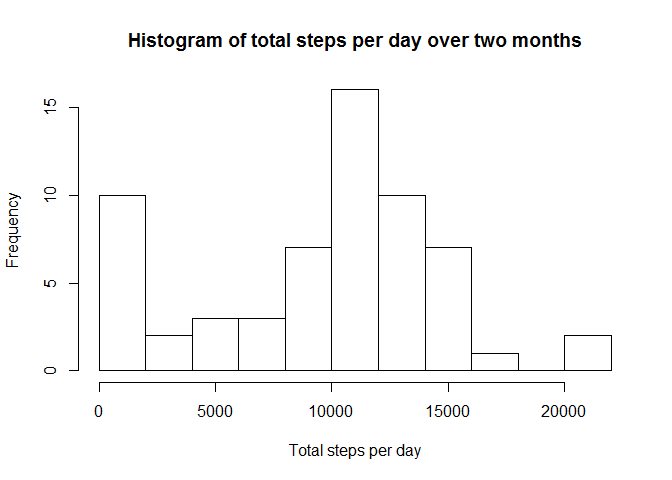
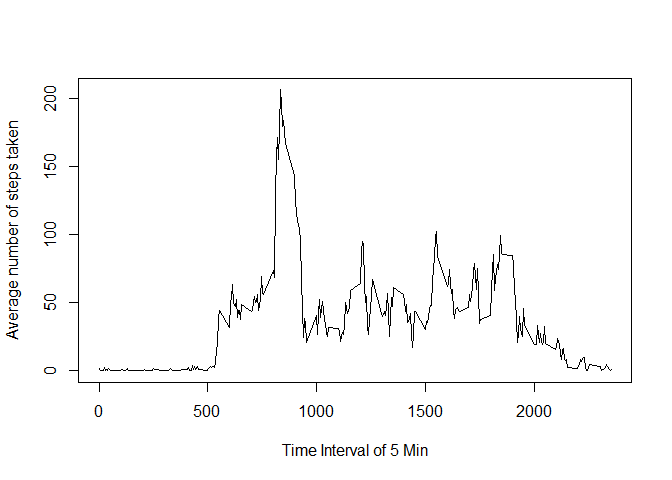
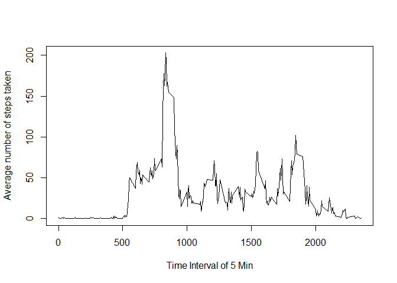
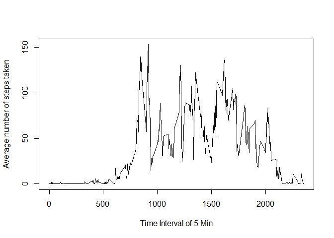

# Reproducible Research: Peer Assessment 1


## Loading and preprocessing the data


```r
options(scipen=1, digits=2)

unzip("activity.zip")
data<-read.csv("activity.csv",header = TRUE)
```


## What is mean total number of steps taken per day?


```r
#Make a histogram of the total number of steps taken each day

library(data.table)
```

```
## Warning: package 'data.table' was built under R version 3.1.2
```

```r
activity <- data.table(data)
activity.totalSteps<-activity[,sum(steps,na.rm = TRUE),by=date]
hist(activity.totalSteps$V1,breaks=10,main="Histogram of total steps per day over two months",
     xlab="Total steps per day")
```

 

```r
#Calculate and report the mean and median total number of steps taken per day

activity.mean=mean(activity.totalSteps$V1,na.rm = TRUE)
activity.median = median(activity.totalSteps$V1,na.rm = TRUE)
```
mean =  9354.23

median = 10395


## What is the average daily activity pattern?


```r
#Make a time series plot (i.e. type = "l") of the 5-minute interval (x-axis) and the average number of steps taken, averaged across all days (y-axis)

activity.totalStepsInterval <- activity[,mean(steps,na.rm = TRUE),by=interval]
plot(activity.totalStepsInterval$interval,activity.totalStepsInterval$V1, type = 'l',xlab='Time Interval of 5 Min',ylab="Average number of steps taken")
```

 


```r
#Which 5-minute interval, on average across all the days in the dataset, contains the maximum number of steps?

maxSteps<-activity.totalStepsInterval[which.max(activity.totalStepsInterval$V1)]
```

Maximum number of steps: 206.17

Time Interval for maximum number of steps: 835


## Imputing missing values

```r
bad<-is.na(activity$steps)
totalNA<-sum(bad)

activity.imputed<-activity
activity.meanByDay<-activity[,mean(steps,na.rm = TRUE),by=date]
activity.meanByDay[is.na(activity.meanByDay)]<-0

for(i in 1:length(activity$steps)){
  if(bad[i]){ 
    activity.imputed$steps[i]<-activity.meanByDay[date == activity.imputed$date[i]]$V1
    }
  }

activity.imputed.totalSteps<-activity.imputed[,sum(steps,na.rm = TRUE),by=date]
hist(activity.imputed.totalSteps$V1,breaks=10,main="Histogram of total steps per day over two months",
     xlab="Total steps per day")
```

 

```r
activity.imputed.mean=mean(activity.imputed.totalSteps$V1,na.rm = TRUE)
activity.imputed.median = median(activity.imputed.totalSteps$V1,na.rm = TRUE)
```

Imputed Stretegy: replace mean by day for missing values 

Total number of rows with NAs: 2304

mean.imputed =  9354.23

median.imputed = 10395

There is no change in mean & median value because missing value have been replaced by 0. mean for perticular day is 0 due to no avaialbility of data. 

## Are there differences in activity patterns between weekdays and weekends?


```r
library(plyr)
```

```
## Warning: package 'plyr' was built under R version 3.1.2
```

```r
activity.imputed <- mutate(activity.imputed,isWeekend = {
     (as.POSIXlt(date,format="%Y-%m-%d")$wday %in% c(0,6))})

temp <- split(activity.imputed,activity.imputed$isWeekend)
activity.weekday <- temp$'FALSE'
activity.weekend <- temp$'TRUE'
```

Average number of steps taken - Weekday


```r
activity.weekday.AvgStepsInterval <- activity.weekday[,mean(steps,na.rm = TRUE),by=interval]
plot(activity.weekday.AvgStepsInterval$interval,activity.weekday.AvgStepsInterval$V1, type = 'l',xlab='Time Interval of 5 Min',ylab="Average number of steps taken")
```

 

Average number of steps taken - Weekend


```r
activity.weekend.AvgStepsInterval <- activity.weekend[,mean(steps,na.rm = TRUE),by=interval]
plot(activity.weekend.AvgStepsInterval$interval,activity.weekend.AvgStepsInterval$V1, type = 'l',xlab='Time Interval of 5 Min',ylab="Average number of steps taken")
```

 


